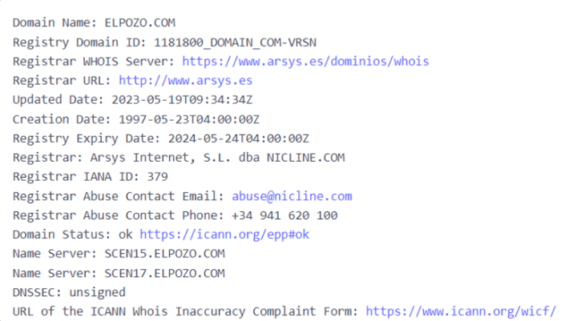
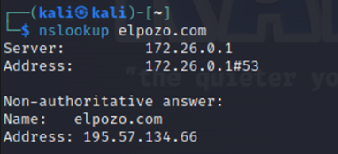
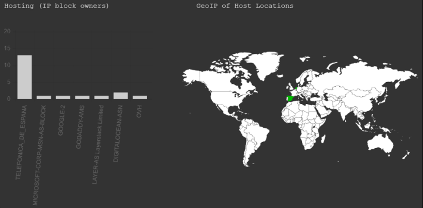
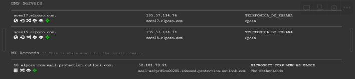
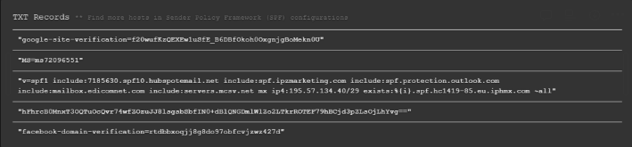
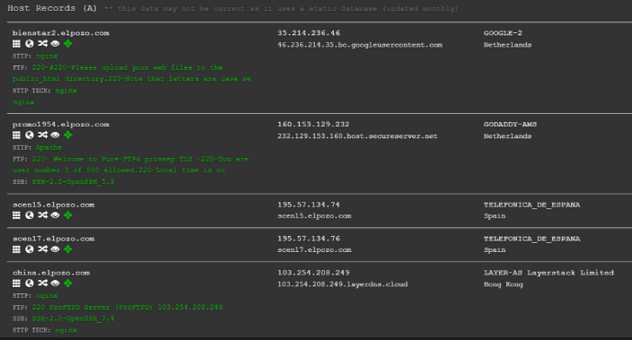
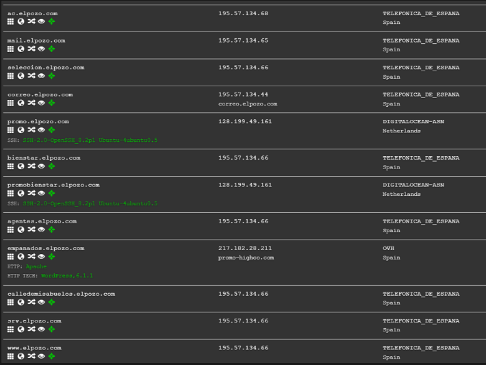
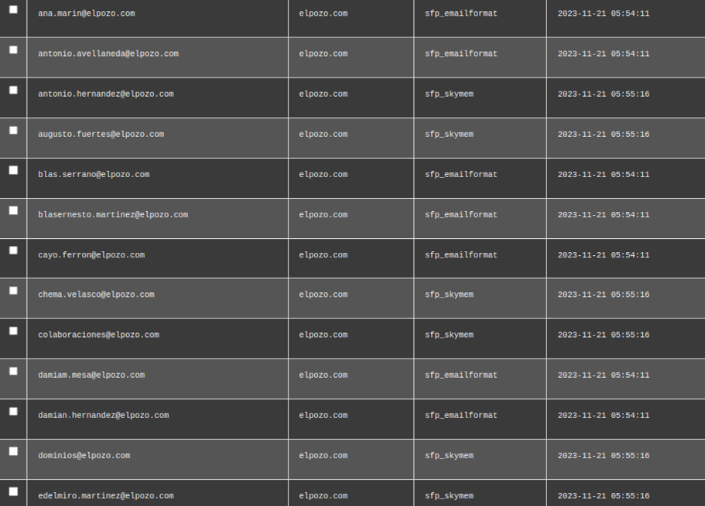

# A08-Mapa-DNS
## WHOIS

Para empezar utilizaremos la herramienta Whois a través de la pagina web “DonDominio”.

En el podemos encontrar:

El nombre del dominio registrado “ELPOZO.COM” junto con su ID “1181800_DOMAIN_COM-VRSN”. También podemos encontrar la URL del registrador en donde se registró el dominio “http://www.arsys.es”. Justo debajo podemos encontrar la fecha de actualización y creación junto con la de expiración. Más abajo encontramos datos sobre el registrador, la entidad o compañia encargada junto con su ID y sus respectivas formas de contacto, teléfono y email.  Debajo de los datos del registrador podemos encontrar el estado del dominio, el nombre de los servidores y el DNSSEC que nos indica si el dominio tiene seguridad de la capa de transporte del sistema de nombres, en este caso no la tiene.

## Nslookup

A continuación, usaremos la herramienta nslookup, que se usa para consultar servidores de nombres de dominio DNS 

Primeramente, nos encontramos con el nombre del servidor y dirección, la primera parte muestra el servidor DNS que esta utilizando mi sistemas para resolver nombre de dominio, así como mi dirección ip. A continuación podemos ver que la respuesta proviene de un servidor DNS que no mantiene los registros DNS oficiales del dominio. Por ultimo nos muestra el nombre de dominio que fue consultado y la dirección IP asociada con ese nombre de dominio.

## Dnsdumpster

A continuación, usaremos “dnsdumpster”, que realiza análisis de DNS para descubrir y visualizar la estructura de la red de un dominio.

En esta imagen que se encuentra dividida podemos encontrarnos con un grafico de los propietarios de Bloques IP en donde muestra la distribución de los propietarios de los bloques IP en los que se encuentran los diferentes servidores relacionados con "elpozo.com". A la derecha podemos ver la ubicación geográfica de los servidores relacionados con el dominio.

En “DNS Servers” encontramos los nombres específicos de los servidores para “elpozo.com” y sus direcciones IP, lo que indica que telefónica es el proveedor de servicios DNS

También podemos encontrar los registros MX que nos proporcionan detalles sobre los servidores de correo electrónicos asociados con el dominio, en este caso esta usando Microsoft

Esta imagen contiene registros de texto que incluyen información de verificación de sitios como Google y Facebook, además de configuraciones de SPF (Sender Policy Framework) que ayudan a prevenir el spoofing de correo electrónico.

En estas dos imágenes encontramos los registros de Host A en donde tenemos en una lista los subdominios y sus respectivas direcciones IP, junto con la tecnología web utilizada (como Apache o nginx) y los proveedores de hosting o las ubicaciones de los servidores.

## Spiderfoot

A continuación, a través de la herramienta “Spiderfoot”, hemos sacado los correos de los empleados de elpozo.com. Con esto podemos llegar a hacer ingeniería social o phishing a los empleados.

